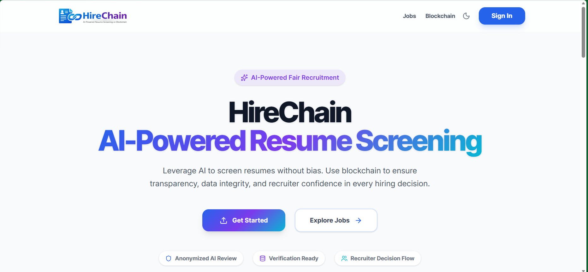
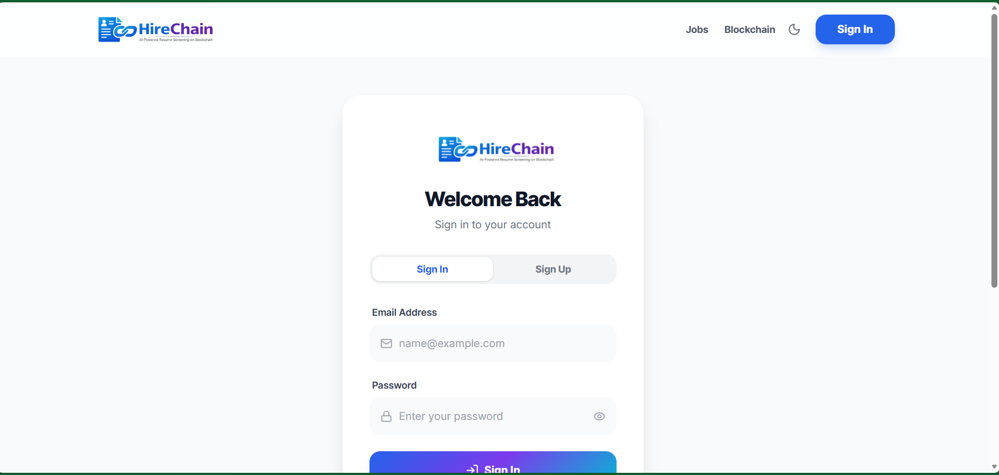
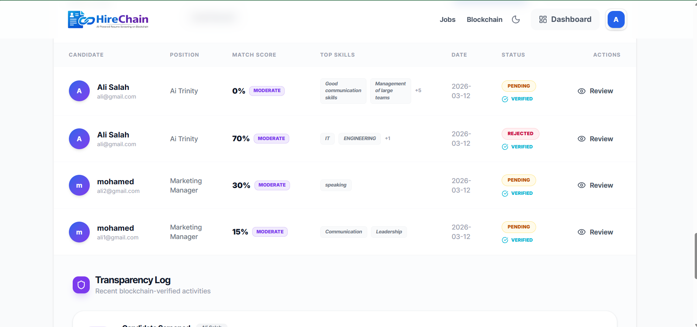
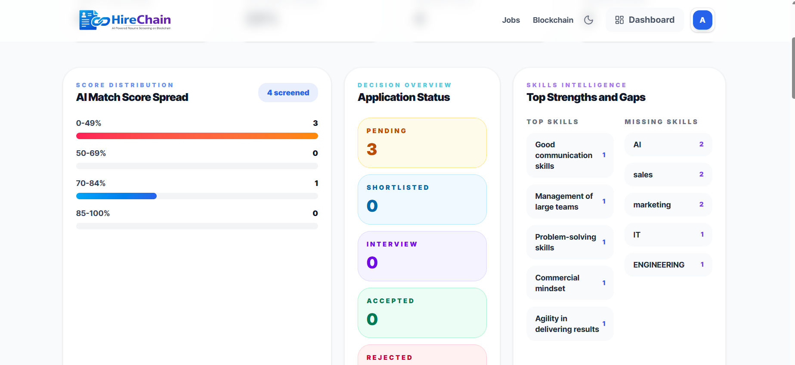
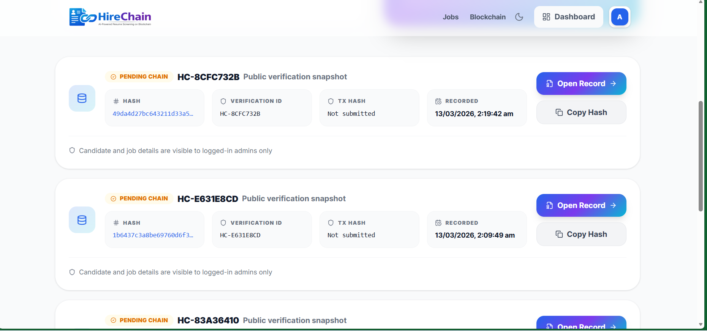

# HireChain: AI-Powered Resume Screening on Blockchain

HireChain is a hackathon project for fair and transparent resume screening. It combines anonymized AI analysis, recruiter workflow tooling, and blockchain-backed verification so hiring teams can review candidates with stronger trust, lower bias, and better auditability.

## Problem

Traditional resume screening is often:

- opaque, because candidates do not know how a score was produced
- biased, because personal identifiers can influence early review
- hard to audit, because screening decisions are not linked to verifiable records
- inefficient, because recruiters must manually sort large applicant pools

The CityU FusionX hackathon challenge asks for a decentralized resume screening system that minimizes bias while preserving transparency and trust. HireChain is built for that exact problem.

## Solution

HireChain provides an end-to-end workflow for candidates, recruiters, and admins:

- candidates apply to a job with a resume and structured profile
- the server parses the resume into text
- personal identifiers are removed before AI analysis
- Gemini analyzes anonymized candidate information against job requirements
- the platform stores the screening result, skill match, and explanation
- a verification hash is created and can be anchored on Sepolia for on-chain proof
- recruiters review the applicant, resume, AI output, and verification record in one interface

## Product Highlights

- Fair resume screening with anonymized AI analysis before scoring
- Recruiter workflow with shortlist, interview, accept, and reject stages
- Candidate-facing AI result view with skills breakdown and verification status
- Recruiter analytics for score distribution, skills trends, pipeline, and fairness checks
- Privacy-first blockchain explorer with restricted sensitive details
- Audit export for recruiter review and verification logs

## Architecture

```text
Candidate -> React Client -> Express API -> Resume Parser -> Anonymizer -> Gemini
                                              |                |
                                              |                -> screening score + skills + explanation
                                              |
                                              -> MongoDB candidate/application records
                                              -> Blockchain hash + verification metadata
                                              -> Sepolia smart contract (optional live deployment)
```

### Architecture Diagram Content

Use this exact system flow in your slide deck or diagram:

```text
[1] User Authentication
    Candidate / Recruiter / Admin
    -> Firebase Authentication
    -> Role-aware access in HireChain

[2] Resume Upload
    Candidate uploads resume + structured profile
    -> React frontend sends file and form data to Express API

[3] Resume Parsing
    Express + Multer receive the file
    -> PDF / DOCX / TXT parser converts resume into plain text

[4] Anonymization Layer
    Parsed resume text + profile text
    -> remove name, email, phone, address, links, and other identifiers
    -> produce anonymized candidate content

[5] AI Analysis
    Anonymized content + job requirements
    -> Gemini API
    -> matched skills, missing skills, explanation

[6] Scoring Engine
    AI result
    -> match score
    -> screening summary
    -> stored in MongoDB

[7] Blockchain Verification
    Candidate/application payload
    -> SHA-256 verification hash
    -> blockchain log in database
    -> optional Sepolia smart contract transaction

[8] Recruiter Review
    Recruiter/Admin dashboard
    -> candidate profile
    -> AI result
    -> resume preview
    -> blockchain verification
    -> accept / reject / pending decision
```

### Diagram Boxes to Draw

If you are building this in PowerPoint, Canva, or Figma, use these boxes:

1. `User Auth`
2. `Resume Upload UI`
3. `Express API`
4. `Resume Parser`
5. `Anonymization Service`
6. `Gemini AI Analysis`
7. `Scoring + Screening Record`
8. `MongoDB`
9. `Blockchain Verification`
10. `Sepolia Smart Contract`
11. `Recruiter/Admin Review Dashboard`

### Diagram Arrows

Connect them in this order:

1. `User Auth -> Resume Upload UI`
2. `Resume Upload UI -> Express API`
3. `Express API -> Resume Parser`
4. `Resume Parser -> Anonymization Service`
5. `Anonymization Service -> Gemini AI Analysis`
6. `Gemini AI Analysis -> Scoring + Screening Record`
7. `Scoring + Screening Record -> MongoDB`
8. `Scoring + Screening Record -> Blockchain Verification`
9. `Blockchain Verification -> MongoDB`
10. `Blockchain Verification -> Sepolia Smart Contract`
11. `MongoDB -> Recruiter/Admin Review Dashboard`
12. `Blockchain Verification -> Recruiter/Admin Review Dashboard`

### Main Flow

1. Candidate authenticates with Firebase-backed login.
2. Candidate selects a job and uploads a resume.
3. Server extracts text from PDF, DOCX, or text-based files.
4. Resume text and profile text are anonymized before being sent to Gemini.
5. AI returns:
   - match score
   - matched skills
   - missing skills
   - explanation
6. Server stores candidate, screening, and verification records in MongoDB.
7. Server creates a cryptographic hash and can submit it to Sepolia.
8. Recruiter/admin reviews the application in a professional dashboard.

## Core Features

- Role-based flows for candidate, recruiter, and admin users
- Recruiter/admin company profile enforcement and company-to-job consistency
- Resume upload with structured candidate information
- Anonymized AI screening before Gemini analysis
- Candidate consent capture before screening
- AI result view with score, skills, missing skills, and explanation
- Blockchain explorer and verification detail pages
- Recruiter/admin applicant review with resume preview and status decisions
- Recruiter/admin analytics:
  - score distribution
  - accepted/rejected/pending counts
  - top matched skills
  - missing skills trends
  - candidate pipeline per job
- Fairness benchmarking dashboard for anonymization coverage, consent coverage, score-band review consistency, and anomaly watchlists
- Profile editing for recruiter/admin company identity

## Ethics and Privacy

HireChain includes in-product fairness and privacy controls:

- **Anonymized screening**: name, email, phone, address, and profile links are removed before AI analysis
- **Candidate consent**: candidates must explicitly consent before anonymized AI screening and verification logging
- **Verification process**: each screening creates a verification record and hash; optional Sepolia support adds transaction proof
- **Auditability**: recruiters can review the AI result, decision notes, verification record, and resume preview together

## Tech Stack

### Frontend

- React 19
- TypeScript
- Vite
- Tailwind CSS
- Framer Motion
- Lucide React
- Axios

### Backend

- Node.js
- Express
- MongoDB
- Mongoose
- Multer
- Firebase Admin

### AI

- Google Gemini API

### Blockchain

- Solidity
- Ethers.js
- Solc
- Sepolia testnet

## Project Structure

```text
.
|-- client
|-- server
`-- README.md
```

## Setup

### 1. Install dependencies

Run these commands in separate terminals:

```powershell
cd server
npm install
```

```powershell
cd client
npm install
```

### 2. Configure backend environment

Create `server/.env` with the required values:

```env
PORT=5000
MONGO_URI=your_mongodb_connection_string

FIREBASE_PROJECT_ID=your_firebase_project_id
FIREBASE_CLIENT_EMAIL=your_firebase_client_email
FIREBASE_PRIVATE_KEY=your_firebase_private_key

GEMINI_API_KEY=your_gemini_api_key

BLOCKCHAIN_ENABLED=true
BLOCKCHAIN_NETWORK=sepolia
BLOCKCHAIN_RPC_URL=your_sepolia_rpc_url
BLOCKCHAIN_PRIVATE_KEY=your_wallet_private_key
BLOCKCHAIN_CONTRACT_ADDRESS=your_deployed_contract_address
BLOCKCHAIN_CHAIN_ID=11155111
BLOCKCHAIN_EXPLORER_URL=https://sepolia.etherscan.io
BLOCKCHAIN_REQUIRE_ONCHAIN=false
```

Notes:

- `BLOCKCHAIN_CONTRACT_ADDRESS` is only available after deploying the contract.
- If Gemini quota is limited, you can add `GEMINI_API_KEY_2` as a fallback key.

### 3. Start the backend

```powershell
cd server
npm run dev
```

### 4. Start the frontend

```powershell
cd client
npm run dev
```

## Blockchain Setup

### Compile the contract

```powershell
cd server
npm run blockchain:compile
```

### Deploy to Sepolia

```powershell
cd server
npm run blockchain:deploy
```

After deployment:

1. copy the deployed contract address
2. add it to `BLOCKCHAIN_CONTRACT_ADDRESS`
3. restart the backend

### Backfill existing jobs with recruiter/admin company

```powershell
cd server
npm run jobs:backfill-company
```

## Screenshots

### Home



The landing page introduces the platform as an AI-powered, privacy-aware resume screening workflow with role-based entry points for candidates, recruiters, and admins.

### Authentication



The login experience supports sign-in and sign-up from one screen, clearer auth messaging, and a cleaner mobile-friendly layout.

### Candidate History And Results



Candidates can track application status, recruiter progress, and AI screening outcomes in one dashboard flow.

### Recruiter And Admin Dashboard



Recruiters and admins can monitor candidate pipelines, filter applicants by score and status, review fairness trends, and export audit data.

### Blockchain Verification



The blockchain view shows verification metadata, explorer details, and safe public verification while keeping sensitive candidate data restricted.

## Judging Alignment

### Technical and Conceptual Knowledge

- clear mapping to decentralized resume screening
- anonymized AI pipeline to address bias
- verification layer for trust and integrity

### Technical Implementation and Problem Solving

- multi-role workflow
- resume parsing and AI analysis
- recruiter decision tools
- blockchain-ready architecture

### Innovation and Industry Relevance

- practical hiring use case
- transparent AI workflow
- explainable recruiter review path

### Ethics and Sustainability

- identity redaction before AI scoring
- explicit candidate consent
- auditable review and verification trail

## Limitations

- blockchain is only fully live if Sepolia RPC, wallet, and deployed contract are configured
- DOC support is weaker than PDF and DOCX
- the project does not yet implement advanced bias benchmarking across demographic groups
- screenshot assets and demo video are not stored in this repository yet
- no external ERP or ATS integration is implemented yet

## Future Improvements

- stronger resume parsing for legacy DOC files and scanned PDFs
- real smart contract event indexing and richer on-chain explorer views
- fairness benchmarking dashboards and bias-measurement reports
- recruiter notifications, interview scheduling, and shortlisting workflows
- exportable compliance and audit reports for enterprise use
- public verifier page for third-party trust checks
- richer BI dashboards with hiring funnel, trend, and skills-gap forecasting
- ATS or ERP integration for enterprise hiring pipelines
- multilingual resume parsing and cross-border recruiter support

## Demo Checklist for Submission

Before submission, prepare:

1. public GitHub repository
2. 10-15 slide presentation
3. 3-5 minute demo video
4. architecture diagram
5. real screenshots
6. Sepolia transaction proof if blockchain mode is enabled

## License

MIT
